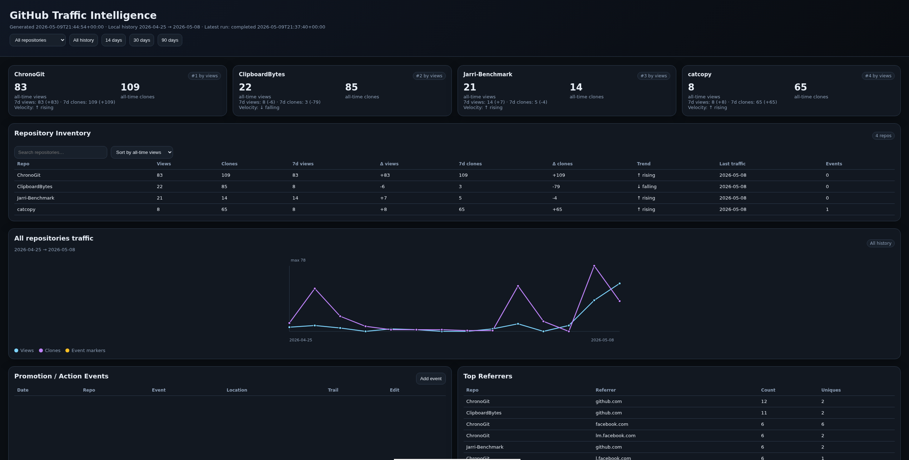

# GitHub Traffic Intelligence

Local-first GitHub repository traffic archival, promotion tracking, propagation intelligence, and repository observability.

GitHub Traffic Intelligence persistently collects and structures GitHub repository traffic data into a local SQLite database, generating a static dashboard and historical intelligence layer over time.

Unlike GitHub’s built-in traffic graphs, this system preserves historical data indefinitely and allows traffic correlation against real-world actions such as:

- Reddit posts
- Facebook posts
- release announcements
- README rewrites
- demo videos
- benchmark publications
- documentation pushes
- social media campaigns
- fork activity
- star/fork growth
- external discovery events

This project treats GitHub traffic as an intelligence surface rather than merely a statistics panel.

---

---

# Why This Exists

GitHub only exposes a limited rolling traffic window.

Without local archival:

- older traffic disappears
- campaign history is lost
- growth trends become invisible
- promotion impact becomes difficult to measure
- repository evolution becomes hard to analyze
- organic propagation becomes difficult to reconstruct

This project solves that problem by continuously collecting:

- repository views
- repository clones
- popular paths
- referrers
- repository metadata
- stars
- forks
- fork lineage
- metadata snapshots

and preserving them locally.

The goal is long-term repository intelligence ownership.

---

# Features

## Historical Traffic Archival

Persist GitHub traffic history indefinitely into SQLite.

Tracks:

- views
- unique viewers
- clones
- unique cloners
- popular paths
- popular referrers

---

## Propagation Intelligence

Track how repository attention spreads over time.

Current propagation surfaces include:

- incoming link timeline
- path timeline
- referrer first-seen intelligence
- path first-seen intelligence
- propagation highlights
- repository metadata timeline
- star/fork/watch snapshots
- fork lineage tables
- fork tree views

This helps answer questions such as:

- Where did this traffic come from?
- Which referrers appeared first?
- Which paths attracted serious attention?
- Did forks appear after a discovery event?
- Did GitHub internal propagation compound after external exposure?

---

## Repository Metadata Intelligence

Collects and preserves repository metadata including:

- stars
- watchers
- forks
- open issues
- default branch
- pushed timestamp
- GitHub update timestamp
- repository URL

Metadata is snapshotted so growth can be analyzed historically.

---

## Fork Lineage

Fork discovery is collected and displayed in the dashboard.

Tracks:

- fork full name
- fork owner
- fork repository name
- fork creation date
- last pushed date
- default branch
- fork stars
- clickable fork links

This allows the dashboard to function as a lightweight repository lineage observatory.

---

## Promotion / Action Event Intelligence

Attach real-world actions to traffic spikes.

Examples:

- posted on `/r/git`
- Facebook launch
- release announcement
- benchmark publication
- new screenshots
- README overhaul
- demo video release

Each event supports:

- editable metadata
- framework grouping
- retroactive correction
- adjustable trail windows
- event overlays on charts

---

## Static Dashboard

No external web server required.

Generates a local static HTML dashboard with:

- repository overview cards
- traffic charts
- event overlays
- referrer tables
- path tables
- inventory/ranking views
- promotion timelines
- propagation timelines
- fork lineage
- first-seen intelligence
- metadata snapshots

---

## Optional Localhost API

Optional localhost-only API for:

- adding events
- editing events
- deleting events
- regenerating dashboards

Security model:

- localhost only
- no public exposure
- no arbitrary shell execution
- structured JSON actions only

---

## Automatic Daily Collection

Supports:

- cron automation
- systemd user services
- fully local-first workflows

---

## SQLite Persistence

Everything is stored locally:

- raw API responses
- normalized traffic tables
- event metadata
- repository inventory
- repository metadata snapshots
- fork lineage
- collection runs
- propagation history

---

# Quick Start

## 1. Clone Repository

    git clone https://github.com/TorMatzAndren/github-traffic.git
    cd github-traffic

---

## 2. Install Dependencies

Debian / Ubuntu:

    sudo apt install python3 sqlite3

---

## 3. Create GitHub Token

Create a GitHub personal access token with repository traffic access.

Recommended:

- fine-grained token
- read-only repository permissions

GitHub:

- Settings
- Developer settings
- Personal access tokens

---

## 4. Install Token Securely

    sudo install -d -m 0750 /etc/tokens
    sudo install -m 0640 -o root -g $USER /dev/null /etc/tokens/github.token

    nano /etc/tokens/github.token

Paste token into:

    /etc/tokens/github.token

---

## 5. Run Setup

    ./setup_github_traffic.sh

This automatically:

- installs local API systemd service
- enables service
- creates local config
- creates dashboard directories
- installs daily cron job
- generates first dashboard

---

## 6. Run First Collection

    ./github_traffic_daily.sh

This:

- collects traffic
- stores SQLite history
- updates repository metadata
- discovers forks
- snapshots propagation surfaces
- regenerates dashboard

---

## 7. Open Dashboard

    ./open_dashboard.sh

---

# Dashboard Overview

The dashboard provides:

- repository overview cards
- historical traffic graphs
- event overlays
- referrer intelligence
- popular path tracking
- repository ranking surfaces
- incoming link timelines
- path timelines
- propagation highlights
- first-seen intelligence
- metadata timeline
- fork lineage and fork tree views

Top repositories are dynamically ranked by traffic activity and velocity.

---

# Propagation Intelligence

GitHub Traffic Intelligence can help reconstruct discovery chains such as:

    Reddit discussion
    → README traffic
    → clone spike
    → fork creation
    → GitHub internal propagation
    → secondary stars/forks

This is especially useful because GitHub’s own traffic windows are temporary.

The local database becomes the historical memory layer.

---

# Promotion Event System

Promotion events are the core manual intelligence layer.

Example:

    Posted ChronoGit on Reddit
    → /r/git
    → framework: reddit_launch
    → trail_days: 7

Traffic changes can then be correlated against real-world actions.

---

# Example Workflows

## Organic Discovery Investigation

1. Notice unexpected clone/view spike
2. Check incoming link timeline
3. Check referrer first-seen table
4. Check path first-seen table
5. Check fork lineage
6. Correlate against stars/forks/metadata timeline

---

## Reddit Launch

1. Post project to Reddit
2. Add event
3. Watch traffic spike appear
4. Compare against future campaigns

---

## Release Push

1. Publish release
2. Add release event
3. Observe clone/view impact

---

## README Rewrite

1. Improve repository presentation
2. Add documentation event
3. Compare conversion changes

---

# Architecture

## Collector

    github_traffic_collect.py

Collects GitHub API endpoints and normalizes traffic, metadata, and forks.

---

## Query Layer

    github_traffic_query.py

Produces structured JSON intelligence surfaces.

---

## Event Layer

    github_traffic_event.py

Handles:

- event insertion
- editing
- deletion
- framework metadata

---

## Dashboard Generator

    generate_static_dashboard.py

Produces static HTML + JSON dashboard.

---

## Local API

    github_traffic_local_api.py

Optional localhost-only structured API.

---

## Automation

    github_traffic_daily.sh
    setup_github_traffic.sh

---

# Database Design

Primary tables:

- collection_runs
- repositories
- repository_metadata_snapshots
- repository_forks
- traffic_views_daily
- traffic_clones_daily
- popular_paths_snapshot
- popular_referrers_snapshot
- raw_api_responses
- promotion_events

Both raw and normalized data are preserved.

---

# Security Model

## Token Handling

Tokens are stored outside the repository:

    /etc/tokens/github.token

Never committed.

Never printed.

---

## Localhost API Restrictions

The API:

- binds only to `127.0.0.1`
- does not expose arbitrary shell execution
- accepts structured actions only
- regenerates dashboards safely

---

## Static Dashboard

Dashboard is static HTML.

No external SaaS dependency.

No external telemetry.

No cloud analytics.

---

# Public vs Jarri Branches

## main

Portable public version.

Features:

- static dashboard
- localhost helper API
- SQLite persistence
- event intelligence
- propagation intelligence
- fork lineage
- metadata snapshots

No Jarri dependency.

---

## jarri-workspace-panel

Experimental Jarri integration branch.

Future goals:

- Jarri Workspace panel
- jarri_cmd_api.py routing
- integrated audit surfaces
- Workspace-native visualization

---

# Automation

## Cron

Daily collection:

    15 9 * * * /home/USER/projects/github-traffic/github_traffic_daily.sh

---

## systemd User Service

Local API:

    systemctl --user status github-traffic-api.service

---

# Philosophy

This project is intentionally:

- local-first
- inspectable
- archival
- deterministic
- portable
- SaaS-independent

The goal is not merely analytics.

The goal is long-term repository intelligence ownership.

---

# Roadmap

Planned future work:

- traffic velocity scoring
- campaign grouping
- anomaly detection
- repository ranking engine
- event impact scoring
- comparative repository analytics
- timeline overlays
- traffic attribution systems
- referrer/path correlation
- fork activity scoring
- repository propagation graphs
- Jarri Workspace integration
- advanced intelligence layers

---

# License

MIT

---

# Author

Tor Matz Andren  
https://jarri.systems
